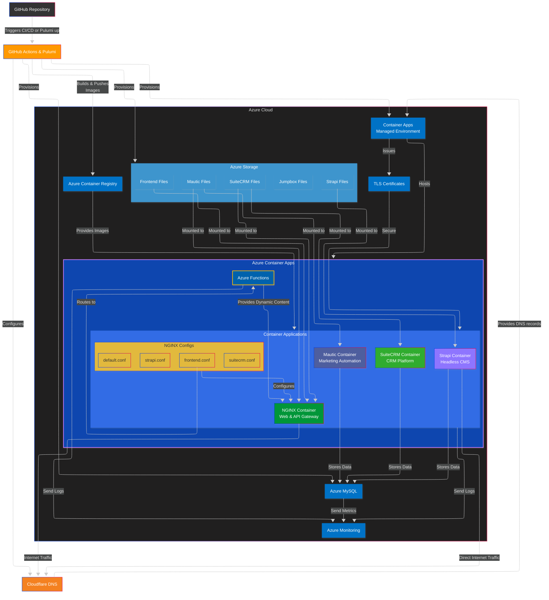
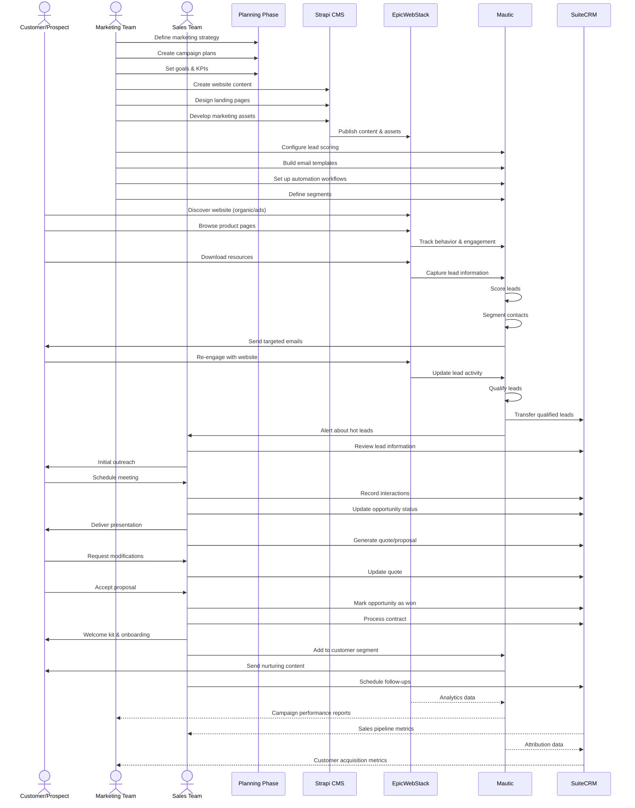
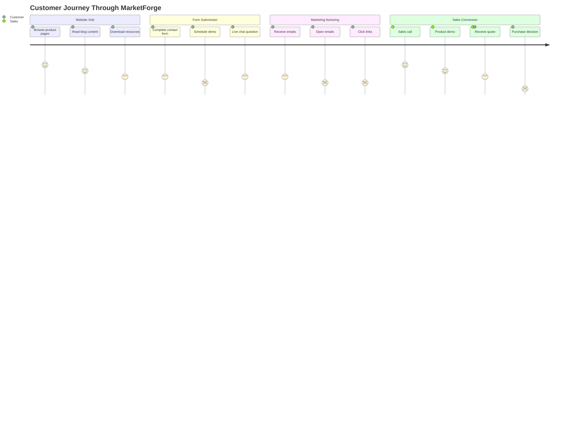

# MarketForge Azure Deployment

This repo is used to produce production environments. This readme likely still has some issues. Don't assume it is 100%, let us know if you find any bugs or submit a PR.

This repository contains the infrastructure code for deploying MarketForge using Pulumi and Azure.

MarketForge is meant to be a turnkey marketing and sales platform comprised of OSS's. Currently we use Hubspot features as the target so that we don't require any significant market research. Being turnkey and low complexity requires opinions, and this stack has a lot of them. If you don't like them, feel free to submit issues to change it. If we decide not to accept the change, then fork this repo and build something better.

WIP

## Architecture

### Infrastructure Architecture

> **Note**: This diagram uses the ELK layout which may not render correctly on GitHub. For best viewing:
>
> - View the [live diagram](https://mermaid.live/edit#pako:eNqNV1tP6zgQ_itWVuKpZdN7m4cjlV6AFUUsRdrV2e6DSdzWIrGrxDnQg_jvZ3xLnDSUwwuZmW_GnpnPY_fdC3lEvMBrt9sbFnK2pbtgwxCK8ZHnIkAkfpGi2JOEBIgR3o5wqlQx5y9Ks2HKeRvz13CPU4GersCe5c-7FB_2aC14infkv403_ZmnxMob738ZRf-tcC5ouKQxyQCnJaTECmwtICK1MC01wXIqyOxxVQCN3ABdppwJwiILtXID9K88OTzzN4s0YgUIjm7m9zvK3maqpuBwf317_y_SYjXynGxxHgtpAlykpUvZjIbsDSpTQgPI5GphUgzT5BRoMzXArRFdYC0dQApMGUll-oWApodDTEMsKGfVtFTCbuLaYbNh_5BndIGmD7foGgvyio8NZCh54HqugHxEULZD01zwRK3aUKSSHa7zDcERNCtDs9W6sWguV1xHKT_EWGx5mlRTLDt8rmBQoqzgf6Vy1YopwJIV0GXOwtO6ln0odQ2rqxDlqjHPo1ql9Dks635c_31XOCipurvZY0MSj2RHgYzVFt7xXZnwijMKa0HTam1msHy0YD_qdMpUo5UVgZkCNRPCRLUIJBVyiae7tfqmW8lB8kmlVNCiRPB3TcU-fwZ_-LjJnyGLA8_kLmUeqN1GTynd7aDEaHb752yOeIoe8jhPKMoPYP4G6tm8dJ_qNgGpNarYhYTJcFc5jSNtz_ZEJnibQH6ZigWFraIfUv6DZiqitJeVggCqL_C_0j7rqKkIRdeOqunbGCselAKa35f8d4JDgNssy62zrHAT5oZnwkDq9VUkKTKIIJKTZp23agEJXpNQ8qQJ41wMErniOUypCAmu0HqyXBiU9nDuiAYPbTVI95powtpRcKEX0l6VG-OzPbmbVxlCswA9xwLrjqrD5ez3K5DdynmYmR-VBsyPDCdmisIhqu_RmWANBGrIWyIk8hGeB4AyWZuVTUzVFskm8EgZgRdBirdbVQqXlPUCzGlKQvF7XiVRNIPgypZDR2Hlh-mAOiwWsCIipWEd4xTtszDO0amU9n6NYMc8jern1Iwgh71BEGSVgevw9NTmMvPEWmHgidV9ppwYnZcG2MLi4qq8Lk4szpOibnNZUbcpGoCSSYpVKgLKxDmyZm212_J4FutKvXnG2MglaeuLlrzQFnOHM_fKOymLoglosaSC0RlaWK3lthxwNaTkSU1VMqFmUDOvrnOnqLvrcqqa-wqMO_VhPWHsSwcaRlZTMFXqa2cmjHGWAQWQWh1taRwHf_j-qDsbtkIe8zR43UOdW9AF_kIKkxbbrzQS-6B7eKsFM6U04XpkMgijxnDG9EW4InsbsDucLQbNAbXpi4CKfkWyk2Fv4gY7SUYNI40eL0aD5fIMWpPYoPuLwWKyOBfbkNgm5k9n3XPRdastutc7A5UMMMDlcjLx_XPYcpgZj_640z3roa8HjV50rya9uUHLbTVxC8apLfiwO503dm-5vJIb_V06yMNggy76w-myMei8M_ahZadBvZaXkDTBNIIfu-9ykY2nftRuvAA-1Y9ab8M-AAdN5esjC71ApDlpeSnPd3sv2OI4Ayk_RPDOnFMMr-zEQg6YfefcFb3g3Xvzgv7wstfzB-Nupz8a-b3RuOUdvaA3vByP-qNJdzTud7q9fv-j5f1U_p3L_nA09ocdv-uPe4NBf_LxC_mACMA) in Mermaid Live Editor



### Process and Data Flow (Sequence Diagram)


### User Journey (Journey Diagram)


## Known Issues and manual steps needed

* Cloudflare DNS entries need manual intervention and are not being made at the right time. it should be after the containers and before the certs and binding so that the containers are created with the a disabled sub domain, the dns entries get made in cloudflare then the certs are created validated and assigned to the container.

  * The config variable `createSubdomains` needs to be run as false on the initial run, then set to true for the second run. After that, leave it on true.
  * It seems that what is happening is the containerApps are initially trying to validate the DNS records before they are "committed" to Cloudflare. I am not sure how yet because the container apps shouldn't have an affect on that. So to get past it I have to manually create the entries in cloudflare. 
  * On the second run I get an error saying that the DNS record is already present, but it creates the certs and binds them. 
  * Then I have to remove the entries in cloudflare and let the code update it. I'm sure this is all dependencies and timing. I just havent dug in yet.
  * `Pulumi up --target` is likely a better solution to this, I just have not yet tried it.
* Availability zone for the mysqlServer in "mysqlServer.ts" is set to `""` because, if not, then the lowest tier subscription is a lot more limited in regions it can be deployed in.
* database admin and user need a clearer separation. To start you can set the same password to get it all to install then change the password after it is setup.
* Mautic's config files still seem to have some issues. the persistant config files are being created as directories because they are not pre-existing in the azure storage. for now you have to delete them and start mautic without them mounted. Let mautic create the files and then move them to storage. Then you can add the mount back and restart.

## Prerequisites
 <!--- TODO: change versions to update automatically. Create a readme template and then use the sed github action to update the readme. --->

1. **Install Pulumi**: Ensure you have Pulumi installed. [Pulumi website](https://www.pulumi.com/docs/get-started/install/) to install Pulumi.
2. **Install Node.js**: Ensure you have Node.js >=20.0.0 installed.  You can download it from [nodejs.org](https://nodejs.org/).
3. **Install Docker**: Ensure Docker is installed and running on your machine. You can download it from [docker.com](https://www.docker.com/).
4. **Azure CLI**: Install the Azure CLI from [docs.microsoft.com](https://docs.microsoft.com/en-us/cli/azure/install-azure-cli).
5. **Cloudflare Account**: You must have a Cloudflare account with an API token. The token should be configured as a secret in Pulumi.
6. **Azure Account**: You must have an Azure account since that is the cloud this is built to run on.
7. Fork this repository

## Setup

1. **Clone the repository**:
    ```sh
    git clone https://github.com/yourusername/MarketForge.git
    cd MarketForge/azure-deploy
    ```

2. **Install dependencies**:
    ```sh
    npm install
    ```

3. **Log in and initialize Pulumi stack**:
    ```sh
    pulumi login
    pulumi stack init dev # replace dev with the name for your stack
    ```

4. **Set configuration values**:

   ### Required Configuration
   Configure the settings that do not have defaults:
    ```sh
    pulumi config set --secret azure:subscriptionId <your-azure-subscription-id>
    pulumi config set --secret azure:dbPassword <your-db-password>
    pulumi config set --secret azure:storageAccountName <your-storage-account-name>
    pulumi config set azure:resourceGroupName <your-resource-group-name>
    pulumi config set --secret azure:mysqlAdminPassword <your-mysql-admin-password>
    pulumi config set azure:mysqlAdminUser <your-mysql-admin-user>
    pulumi config set azure:mysqlServerName <your-mysqlServerName>
    pulumi config set azure:mysqlSkuName <sku-name>
    pulumi config set azure:mysqlSkuTier <sku-tier>
    pulumi config set azure:domain <your-domain> 
    pulumi config set --secret cloudflare:apiToken <your-cloudflare-api-token>
    pulumi config set --secret strapi:adminJwtSecret <your-adminJwtSecret>
    pulumi config set --secret strapi:jwtSecret <your-jwtSecret>
    pulumi config set --secret strapi:appKeys <your-appKeys>
    pulumi config set azure:dbClient mysql    # dbClient currently needs to be mysql changing this shouldn't be much it just needs the right drives to be installed. 
    ```

   ### Optional Configuration

   ```sh
   pulumi config set azure:location <your-azure-location>
   pulumi config set azure:appEnv <dev|prod>
   pulumi config set azure:cmsSubdomain cms     # override defaults if needed
   pulumi config set azure:crmSubdomain crm
   pulumi config set azure:mapSubdomain map
   pulumi config set azure:imageTag <your-image-tag>
   pulumi config set azure:mysqlDbName <your-mysql-db-name>
   ```

   ### Database name configuration

   If you are running multiple instances of Marketforge but using the same database server you will need to make sure your database names do not clash with the defaults
<!--- TODO: Make these configurations the where DB's can get thier names --->

   ```sh
   pulumi config set mautic:mysqlDbName <your-mysql-db-name>
   pulumi config set strapi:mysqlDbName <your-mysql-db-name>
   pulumi config set suitecrm:mysqlDbName <your-mysql-db-name>
   ```

5. **Note on Cloudflare**:  
   The Cloudflare API token is used to create DNS records for your application's custom domains. Ensure you have the token available in your environment or Pulumi's secure store. It will be referenced in code as `marketing:apiToken`.

## Deployment

1. **Build and deploy the infrastructure**:
    ```sh
    pulumi up
    ```

2. **Verify deployment**:
    After the deployment is complete, verify your resources in the Azure portal and check that Cloudflare DNS records have been created correctly.

## Cleanup

To clean up the resources created by Pulumi, run:
```sh
pulumi destroy
pulumi stack rm
```

## Additional Notes

- **Cloudflare DNS Records**: The deployment creates both CNAME and TXT records in Cloudflare for domain verification. If you need to adjust the record types or values, refer to the `customDomains.ts` file.
- **Secrets Management**: All sensitive configuration (API tokens, passwords, secret keys) is managed securely using Pulumi's secret mechanism.
- **Environment Specific Configs**: Use the corresponding config file (e.g., `Pulumi.test.yaml`) for different environments.

For more detailed information, refer to the Pulumi and Azure documentation.
